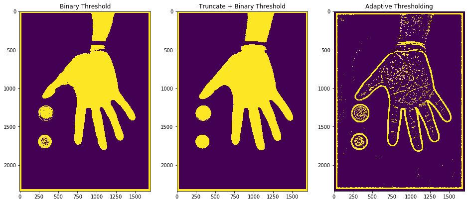
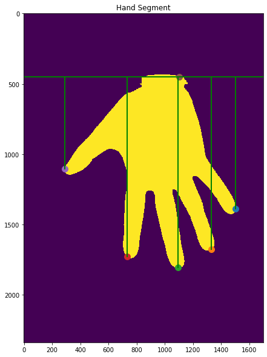

# Fast and Reliable Screenings Instrument to measure hand-size
##### Computer Vision and Image Processing

*Date: 29-05-2021*

# Setup
```bash
pip install -r requirements.txt
```
# Usage
```bash
cd handscans/
python3.9 ../src/main.py handscans.csv
```

----

# Introduction 
Musicians make intensive use of their hands, often in extreme positions.
This may lead to injury of the hands.
A natural question arising in this context is whether there is an influence of hand and finger size on the risk to develop injuries.
The rehabilitation doctor Dr. Woldendorp is interested in this question, and would like to have a simple and accurate method for measuring hand size. 


# System Design
The method for measuring hand size can be broken down into multiple processing steps and techniques. Perhaps, "working backwards" will give most intuitive breakdown of those steps:

- [x] Measure distance between fingers in 'cm'
- [x] Calculate 'pixel per cm' ratio
- [x] Measure distance between points in pixels
- [x] Find projections of finger tips onto a axis through the wrist
- [x] Calculate equation of a line through the wrist
- [x] Find points representing finger tips
- [x] Fit a circle into the hand segment (whose diameter represents hand width)
- [x] Fit a convex polygon around the hand segment (whose inflection points represent finger tips)
- [x] Find contours of the segments
- [x] Isolate hand and coin segments based on pixel area 
- [x] Segment the image
- [x] Change colour representation of the image

In essence, these task encapsulate theory from topics, such as image representation, image segmentation, feature detection, point processing and geometry. 

## Constraints
- A black wristband must be worn to improve segmentation results
- A black cloth must be placed on top of the hand and reference objects to improve segmentation results
- The hand must be held straight with respect to the wrist and scanner axes for accurate measurements
- Reference objects: 1 Euro and 2 Euro coins
 
# Image Segmentation




# Feature Detection




# Measurements Results


